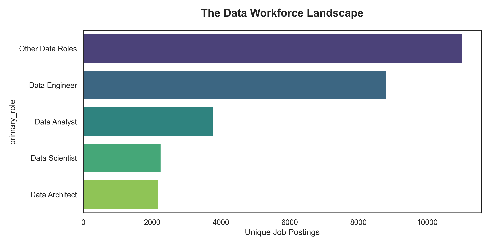
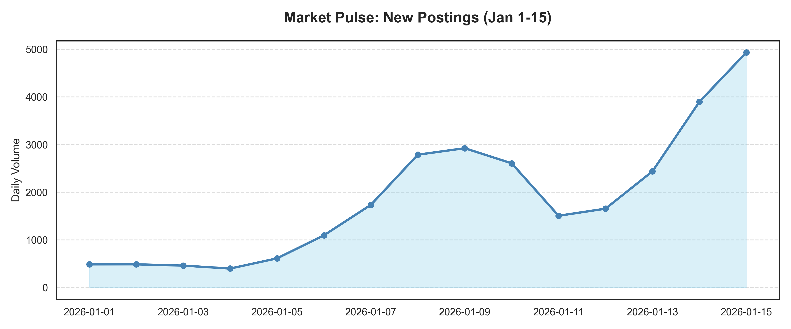
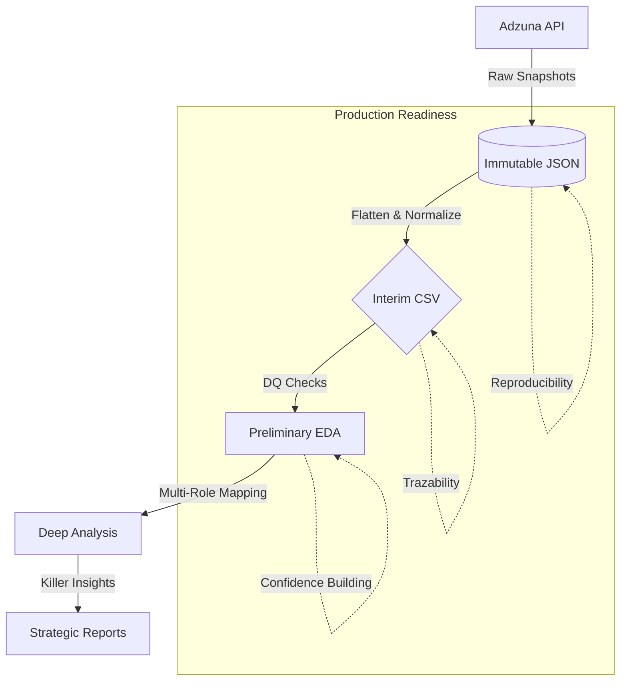

# **Data Quality Hell: The Art of Taming Global Job Market Chaos**

## � **Why This Project Exists?**

In the modern Data/AI landscape, **most projects fail not because of weak models, but because of weak foundations.** Decisions made on ambiguous, redundant, or malformed data are not just wrong—they are expensive. 

**Data Quality Hell** exists to prove that specialized data engineering—triage, normalization, and semantic deduplication—is the real unsung hero of the AI revolution. True value is built on **Trust**, not just algorithms.

---

## 🚀 **The Mission: Turning Sludge into Strategic Gold**

This project handles a chaotic stream of **39,844 raw records** across **19 countries**. It's a professional demonstration of how to navigate the common "pains" of real-world data:
- **API Drift:** Inconsistent schemas across different country endpoints.
- **Semantic Ambiguity:** Is a "Data Scientist" also an "ML Engineer"?
- **Noise Concentration:** Managing 11k+ redundant records without losing the underlying classifications.

### **Market Insights at a Glance**
| Role Distribution | Market Pulse |
| :---: | :---: |
|  |  |

---

## 🛠 **Core Challenges & High-Impact Solutions**

### **The Multi-Role Paradox (Solving Semantic Overlap)**
> **The Problem:** A single job ad often matches multiple keyword searches (e.g., 'Big Data' and 'Engineer'). Traditional deduplication simply deletes the "duplicates," losing 40% of the role context.
>
> **The Solution:** I developed a **Multi-Role Aggregator**. Instead of dropping entries, we assigned multiple role tags to unique Job IDs. This preserves the richness of the market demand and prevents skewed metrics.

## 🧪 **The Analyst's & Scientist's Edge**

While the core of this project is engineering-heavy, the **ultimate goal is analytical excellence**. As a Data professional, I believe that building a model on shaky data is a liability. 

By solving the "Data Quality Hell", I enable:
- **Statistical Integrity:** Categorical distributions are not skewed by naive deduplication.
- **Feature Readiness:** Standardized fields (dates, titles, companies) are ready for immediate NLP and Trend Analysis.
- **Actionable Truth:** Transforming 40k noisy points into a clear narrative of the global job market.

---

## 🏗 **The Production-Grade Architecture**

We move beyond "one-off scripts" toward a reproducible, observable pipeline.

---

## 📈 **Roadmap to Production Reliability**

This is not a finished script—it's a foundation for a production data warehouse.

- [x] **Phase 1: Ingestion & Taming.** Reliable pagination, rate-limiting, and immutable storage.
- [x] **Phase 2: Semantic Deduplication.** Moving from "ID unique" to "Contextual Multi-Role" analysis.
- [ ] **Phase 3: Automated Observability.** (Next Step) Implementing automated checks for schema drift and data volume anomalies.
- [ ] **Phase 4: Feature Warehouse.** Transitioning from CSVs to an optimized SQL/Parquet layer for BI tools.

---

## 🧪 **Real-World "Pains" Addressed**

This project is built based on honest technical pains encountered in production:
1. **Definition Ambiguity:** Data Analysts vs. BI Engineers—mapping the gray areas.
2. **Defensive Programming:** Handling malformed dates and missing company display names gracefully.
3. **Reproducibility:** Ensuring that the "Model Case" snapshot can be re-run and verified by any stakeholder.

---

## 🤝 **Let's Connect**

I don't just "clean" data. I build the systems that make data **trustworthy**. If you are looking for a Data professional who prioritizes structural integrity over vanity metrics, let's talk.

---
*Created by [BNovelo](https://github.com/bnovelorotger)*
