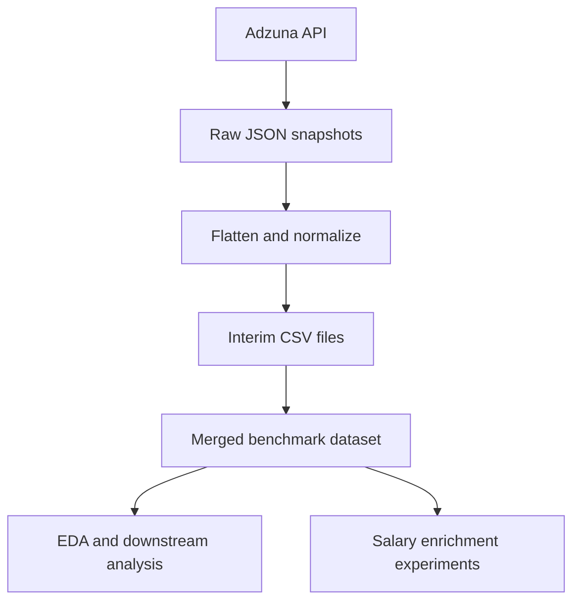
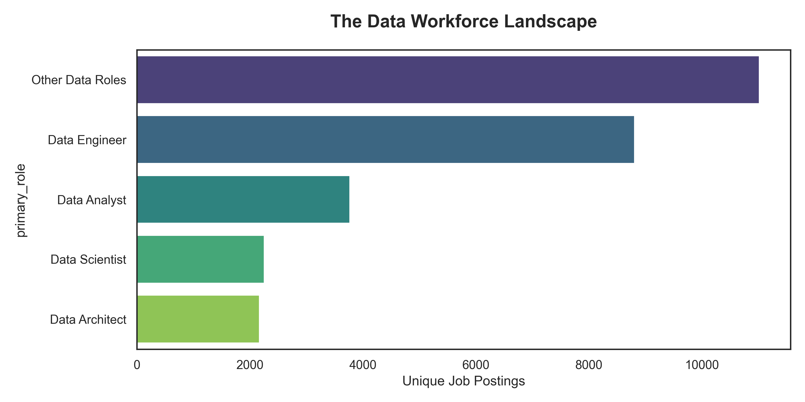
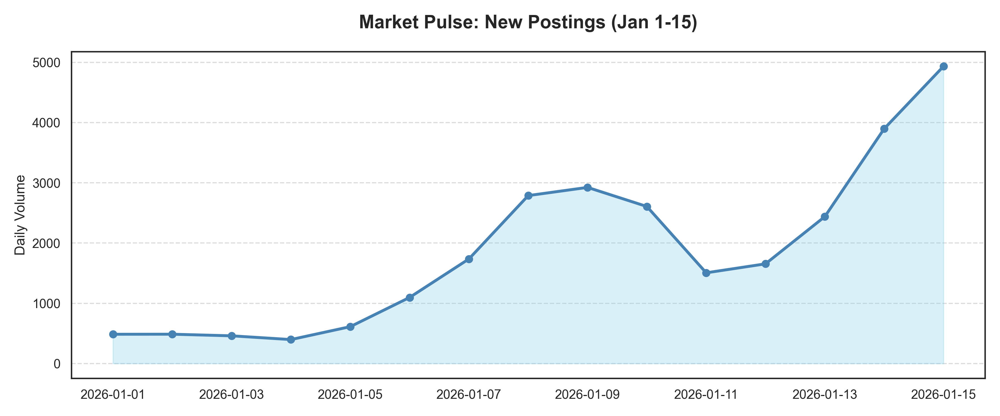

# Data Quality Hell

End-to-end data quality and analytics engineering project built on 39,844 raw job ads collected across 19 countries.

This repository shows how I approach a common real-world problem: the data looks large and useful on the surface, but it is noisy, duplicated, semantically inconsistent, and risky to analyze without structural cleanup first.

## Why this project matters

Most analytics projects do not fail because of dashboards or models. They fail because the underlying data is ambiguous, duplicated, or poorly normalized.

In this project, the goal is not just to extract job ads from the Adzuna API. The goal is to turn a noisy multi-country dataset into something reliable enough for analysis, reporting, and future AI use cases.

## Scope

- 39,844 raw rows in the benchmark merged dataset
- 19 countries
- 6 role-oriented search terms:
  - `Data`
  - `Data Analyst`
  - `Data Architect`
  - `Data Engineer`
  - `Data Scientist`
  - `Mlops`

## Core problems addressed

### 1. Schema and source inconsistency
Different country endpoints and API responses do not always behave consistently. The ingestion and flattening steps normalize those differences into a reproducible structure.

### 2. Semantic overlap
The same job ad can appear under multiple search terms. A naive deduplication strategy would remove rows and lose important context about how the market describes a role.

### 3. Analysis on unstable foundations
Before notebooks, charts, or salary modeling, the dataset needs cleanup, validation, traceability, and consistent transformations.

## Pipeline


```mermaid
graph TD
    A[Adzuna API] --> B[Raw JSON snapshots]
    B --> C[Flatten and normalize]
    C --> D[Interim CSV files]
    D --> E[Merged benchmark dataset]
    E --> F[EDA and downstream analysis]
    E --> G[Salary enrichment experiments]
```

## Repository structure

```text
assets/                    Visual outputs used in the README
data/interim/              Benchmark merged dataset used by notebooks
data/reference/            Reference metadata such as country mappings
docs/DATA_EXTRACTION.md    Replication guide for ingestion and processing
notebooks/                 Exploratory and deep-dive analysis
src/ingestion/             API ingestion scripts
src/processing/            Flattening and merge logic
src/analysis/              Preliminary analysis scripts
src/enrichment/            Salary prediction and enrichment experiments
```

## Key outputs

### Market visuals
| Role distribution | Market pulse |
| --- | --- |
|  |  |

### What this repo demonstrates

- Building a multi-step ingestion and processing flow instead of a one-notebook analysis
- Working with imperfect real-world data rather than curated toy datasets
- Preserving business meaning while handling duplicates and overlap
- Producing an analysis-ready benchmark dataset for downstream work

## How to run it

Install dependencies:

```bash
pip install -r requirements.txt
```

Set Adzuna credentials in a `.env` file:

```env
ADZUNA_APP_ID=your_id_here
ADZUNA_APP_KEY=your_key_here
```

Run the main flow:

```bash
python src/ingestion/run_tech_ingestion.py
python src/processing/flatten_raw.py --start-date 2026-01-01 --end-date 2026-01-15
python src/processing/merge_data.py
```

Detailed replication steps are documented in [docs/DATA_EXTRACTION.md](docs/DATA_EXTRACTION.md).

## Recommended entry points

- `notebooks/eda_preliminary.ipynb`
- `notebooks/eda_spain_deep_dive.ipynb`
- `src/processing/flatten_raw.py`
- `src/processing/merge_data.py`

## Recruiter summary

If you want the short version: this is a portfolio project about data trust.

It combines ingestion, normalization, reproducibility, and analysis on a dataset that is large enough and messy enough to show practical judgment, not just notebook fluency.
