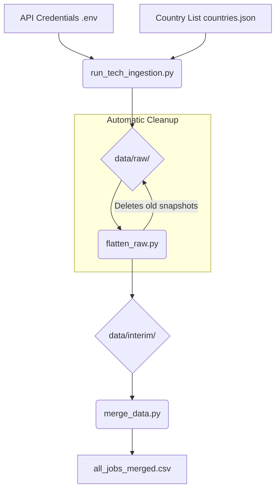

# Data Extraction & Processing Guide

This guide details the steps to replicate the data extraction, ingestion, and initial processing flow for the **Data Quality Hell** project.

## 1. Prerequisites

### API Credentials
You need an Adzuna API ID and Key. Create a `.env` file in the root directory:
```env
ADZUNA_APP_ID=your_id_here
ADZUNA_APP_KEY=your_key_here
```

---

## 2. Process Flow



---

## 3. Step-by-Step Execution

### Step A: Specialized Tech Ingestion (The Model Case)
To replicate the **Model Case (Jan 1-15, 2026)**, we use a specialized orchestrator that targets the most relevant data roles across 19 countries. This script ensures a high-density dataset for analysis.

```bash
# Iterates over: Data Engineer, Scientist, Analyst, MLOps, Architect
python src/ingestion/run_tech_ingestion.py
```
- **Configuration**: Uses a depth of 50 pages per role/country to reach the Jan 1st - 15th window.
- **Output**: Multi-page JSON files saved in `data/raw/adzuna__{country}__what_{role}__/`.
- **Note**: This process creates the foundation for our **Multi-Role Paradox** analysis.

### Step B: Flattening & Cleanup (Strict Filtering)
Process the raw JSON snapshots and filter for the specific project period (January 1st to 15th).

```bash
python src/processing/flatten_raw.py --start-date 2026-01-01 --end-date 2026-01-15
```
- **Actions**:
  1. Identifies all snapshots in `data/raw/`.
  2. Keeps only the **latest** version for each country/role and deletes stale ones.
  3. Extracts core fields and applies strict date filtering.
- **Output**: Individual role/country CSVs in `data/interim/{country}_{role}_jobs.csv`.

### Step C: Data Merging
Consolidate all individual segments into a single master dataset.

```bash
python src/processing/merge_data.py
```
- **Action**: Merges all interim CSVs and adds/normalizes the `country_code` column.
- **Output**: `data/interim/all_jobs_merged.csv` (approx. 39,844 raw rows before semantic deduplication).

---

## 4. Git & Data Strategy

To maintain a professional showcase, we follow a split-data strategy:

- **Included in Git**: Source code, documentation, and the **Benchmark Master Dataset** (`data/interim/all_jobs_merged.csv`).
- **Excluded from Git**: Raw JSON snapshots (too heavy/private) and intermediate CSVs.
- **Rationale**: We include the master CSV so that anyone cloning the repo has the "Gold Standard" data used in the Jupyter Notebooks immediately available.

---

## 5. Replication Checklist
- [ ] Verify `.env` variables.
- [ ] Run `run_tech_ingestion.py` (Wait for API throttling).
- [ ] Run `flatten_raw.py` with 2026 date filters.
- [ ] Run `merge_data.py`.
- [ ] Final result available in `data/interim/all_jobs_merged.csv`.
